  

 

**Me gusta programar y convertir ideas en proyectos útiles.**

Soy desarrollador web en formación en el **SENA**, desde **Urrao, Colombia**.
Trabajo con **Python y Django**, conectando interfaces web con bases de datos.

🐝 **Ahora estoy trabajando en [Mi Colmena](https://github.com/JUNMARANC/MiColmena)**: un sistema de gestión de apiarios desarrollado en equipo. Mi aporte incluye interfaces, formularios y validaciones de los paneles del sistema.

 

**Tecnologías que utilizo**

**En práctica:** MongoDB y arquitectura MVT de Django.  
**Me interesa:** la ciberseguridad.

Un poco más sobre mi formación y mis proyectos

 

Estudio el **Tecnólogo en Análisis y Desarrollo de Software** en el SENA.

También he trabajado en prácticas de:

- Gestión de actividades extracurriculares: grupos, horarios y asistencia con Django.
- Operaciones CRUD de productos con Django, MySQL y MongoDB.
- Importación de productos y categorías desde Excel con openpyxl.

Estoy fortaleciendo mi lógica de programación, el diseño de modelos y relaciones,
las validaciones y la resolución de errores.

